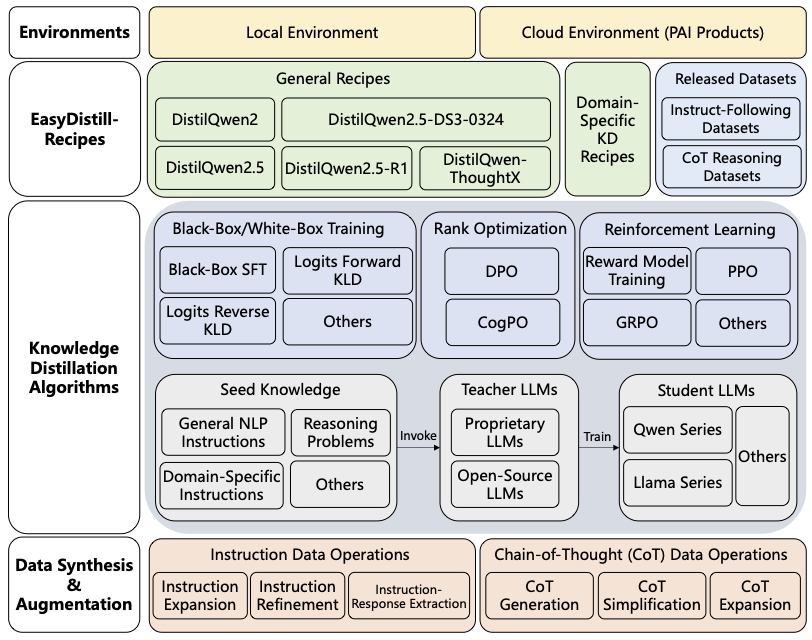

# EasyDistill: Easy Knowledge Distillation for Large Language Models

<div align="center">

[中文](./README_zh.md) | [English](./README.md)

</div>

**EasyDistill** 是一个专为大语言模型（LLMs）知识蒸馏（KD）而设计的开创性工具包。随着大语言模型复杂性和规模的不断增长，**EasyDistill** 提供了一个多功能且用户友好的平台来简化知识蒸馏过程，支持黑盒和白盒两种方法。它促进高效的模型训练，使较小的模型能够在不损失准确性的情况下模拟较大模型的性能。**EasyDistill** 拥有广泛的功能特性，包括数据合成、监督微调、排序优化和强化学习，所有这些都针对各种知识蒸馏场景进行了定制。该工具包设计用于适应系统1（快速、直觉）和系统2（缓慢、分析）认知模型，具有模块化和易于使用的特点，配备简单的命令行界面来指导用户。除了学术探索之外，**EasyDistill** 还锚定实际的工业解决方案，提供强大的蒸馏模型和开源数据集，同时展示与阿里云AI平台PAI的无缝集成。致力于连接理论进步与实际需求，**EasyDistill** 赋能NLP社区，使最先进的知识蒸馏策略对研究人员和行业从业者都变得可及。

# 技术文章

我们有一系列关于EasyDistill功能的技术文章。

- [人工智能平台 PAI DistilQwen2.5-DS3-0324发布：知识蒸馏+快思考=更高效解决推理难题](https://developer.aliyun.com/article/1661734)
- [DistilQwen2.5-R1发布：知识蒸馏助推小模型深度思考](https://developer.aliyun.com/article/1659288)
- [DistilQwen2.5发布：通义千问蒸馏小模型再升级](https://developer.aliyun.com/article/1653842)
- [DistilQwen2：通义千问大模型的知识蒸馏实践](https://developer.aliyun.com/article/1633882)
- [基于多轮课程学习的大语言模型蒸馏算法TAPIR](https://developer.aliyun.com/article/1635146)


## 概述



- **工具包特性**：EasyDistill提供多功能性，包括数据合成、监督微调、logits蒸馏、排序优化和针对知识蒸馏场景定制的强化学习技术。
- **兼容性**：支持系统1（快速、直觉）和系统2（缓慢、分析）模型。
- **用户友好**：凭借其模块化设计和简单的命令行界面，EasyDistill使知识蒸馏策略的实验和实现变得简单直接。
- **工业集成**：整合基于知识蒸馏的解决方案，支持与阿里云人工智能平台（PAI）等平台的集成。


## 快速开始

1. 克隆仓库：
    ```bash
    git clone https://github.com/modelscope/easydistill
    cd EasyDistill
    ```

2. 安装所需依赖：
    ```bash
    python setup.py install
    ```

3. 通过命令行界面探索EasyDistill的使用：
    ```bash
    easydistill --config <config-file-path>
    ```

    配置文件表达了**EasyDistill**支持的任何知识蒸馏作业的详细设置。黑盒蒸馏配置示例如下所示：
    ```json
    {
        "job_type": "kd_black_box_local",
        "dataset": {
            "instruction_path": "train.json",
            "labeled_path": "train_labeled.json",
            "template" : "chat_template/chat_template_kd.jinja",
            "seed": 42
        },
        "inference":{
            "enable_chunked_prefill": true,
            "seed": 777,
            "gpu_memory_utilization": 0.9,
            "temperature": 0.8,
            "trust_remote_code": true,
            "enforce_eager": false,
            "max_model_len": 4096,
            "max_new_tokens": 512
        },
        "models": {
            "teacher": "teacher/Qwen/Qwen2.5-7B-Instruct/",
            "student": "student/Qwen/Qwen2.5-0.5B-Instruct/"
        },
        "training": {
            "output_dir": "./result/",
            "num_train_epochs": 3,
            "per_device_train_batch_size": 1,
            "gradient_accumulation_steps": 8,
            "save_steps": 1000,
            "max_length": 512,
            "logging_steps": 1,
            "learning_rate": 2e-5,
            "weight_decay": 0.05,
            "warmup_ratio": 0.1,
            "lr_scheduler_type": "cosine"
        }
    }
    ```

## DistilQwen系列

**DistilQwen**模型代表了从**EasyDistill**工具包衍生的强大蒸馏语言模型套件。基于知识蒸馏原理设计，DistilQwen模型在保持高性能的同时显著减少了模型大小，使其非常适合资源受限的环境。无论您是希望在工业场景中高效部署，还是寻求探索先进的知识蒸馏方法，**DistilQwen**模型都准备好以敏捷性和精确性满足多样化的应用需求。


### 最新进展：自适应思维模型

最新的**DistilQwen**系列是**DistilQwen-ThoughtX**，与其前身相比，它展现出改进的推理能力并生成更优长度的思维链（CoTs）。该模型系列是通过利用新颖的推理冗余度（RV）和认知难度（CD）评分从创新的**OmniThought**数据集开发而来，这些评分确保模型接收到反映最优CoT输出长度和难度的丰富、高质量训练数据。**DistilQwen-ThoughtX**在开源社区中超越了其他知识蒸馏模型。**DistilQwen-ThoughtX**的性能如下所示。


| **Model**                                     | **AIME2024** | **MATH500** | **GPQA-D** | **LCB V2** | **Avg.**  |
|-----------------------------------------------|--------------|-------------|------------|------------|-----------|
| OpenThinker-7B                                | 31.3         | 83.0        | 42.4       | 39.9       | 49.1      |
| DeepSeek-R1-Distill-Qwen-7B                   | **57.3**     | _89.6_      | 47.3       | 48.4       | 60.6      |
| OpenThinker2-7B                               | 50.0         | 88.4        | _49.3_     | _55.6_     | _60.8_    |
| **DistilQwen-ThoughtX-7B**                    | _56.7_       | **90.2**    | **50.0**   | **56.8**   | **63.4**  |
| LIMO-32B                                      | 56.7         | 86.6        | 58.1       | 60.0       | 65.3      |
| OpenThinker-32B                               | 66.0         | 90.6        | 61.6       | 68.9       | 71.7      |
| DeepSeek-R1-Distill-Qwen-32B                  | 74.7         | 90.0        | 62.4       | 72.3       | 74.8      |
| OpenThinker2-32B                              | _76.7_       | _90.8_      | **64.1**   | _72.5_     | _76.0_    |
| Light-R1-32B                                  | 74.7         | 90.4        | 62.0       | 56.0       | 70.7      |
| s1.1-32B                                      | 59.3         | 87.4        | 62.0       | 58.7       | 66.8      |
| **DistilQwen-ThoughtX-32B**                   | **80.0**     | **92.6**    | _64.0_     | **73.4**   | **77.5**  |

**OmniThought**数据集也已公开发布。请参考数据集部分。

### 系统1模型

**DistilQwen2**是Qwen2模型的增强版本，配备了针对各种NLP任务的改进指令跟随能力。我们使用GPT-4和Qwen-max作为教师模型来生成高质量响应，平衡输入指令的任务分布。在监督微调（SFT）之后，使用DPO算法执行排序优化过程，以增强学生模型与教师模型之间的对齐。**DistilQwen2.5**模型使用黑盒和白盒知识蒸馏算法的组合进行训练。我们遵循与**DistilQwen2**生产中采用的相同指令数据处理和黑盒SFT程序。随后，应用白盒训练来完善学生从教师模型获取复杂知识的能力，特别是利用Qwen2.5-72B-Instruct作为开源教师模型。**DistilQwen2**和**DistilQwen2.5**的性能如下所示。

| **Model**                          | **AlpacaEval 2.0 (length control)** | **MT-Bench** | **MT-Bench (single)** | **IFEval (instruct-loose)** | **IFEval (strict-prompt)** |
|------------------------------------|-------------------------------------|--------------|-----------------------|-----------------------------|----------------------------|
| Qwen2.5-0.5B-Instruct              | 2.46                                | 5.49         | 6.26                  | 42.81                       | 30.31                      |
| **DistilQwen2.5-0.5B-Instruct**    | **4.89**                            | **5.78**     | **6.83**              | **52.61**                   | **37.82**                  |
| Qwen2-1.5B-Instruct                | 5.22                                | 5.85         | 6.45                  | 41.37                       | 28.10                      |
| **DistilQwen2-1.5B-Instruct**      | **8.28**                            | **6.42**     | **7.12**              | **49.76**                   | **36.04**                  |
| Qwen2.5-1.5B-Instruct              | 6.69                                | 7.09         | 7.66                  | 55.40                       | 40.11                      |
| **DistilQwen2.5-1.5B-Instruct**    | **13.69**                           | **7.35**     | **7.99**              | **61.10**                   | **74.49**                  |
| Qwen2.5-3B-Instruct                | 17.98                               | 7.92         | 8.40                  | 61.18                       | 74.58                      |
| **DistilQwen2.5-3B-Instruct**      | **20.91**                           | **8.37**     | **8.97**              | **67.03**                   | **77.36**                  |
| Qwen2-7B-Instruct                  | 24.33                               | 8.27         | 8.68                  | 66.67                       | 52.31                      |
| **DistilQwen2-7B-Instruct**        | **25.35**                           | **8.40**     | **9.03**              | **71.46**                   | **60.26**                  |
| Qwen2.5-7B-Instruct                | 31.43                               | 8.52         | 8.83                  | 81.53                       | 72.10                      |
| **DistilQwen2.5-7B-Instruct**      | **34.86**                           | **8.76**     | **9.22**              | **83.48**                   | **73.27**                  |


我们已向公众发布了两个指令跟随数据集。请参考数据集部分。


### 系统2模型

**DistilQwen2.5-R1**模型系列利用DeepSeek-R1作为教师模型。为了将较小蒸馏模型的推理能力与其内在认知能力对齐，模型使用我们的CogPO算法进一步完善，该算法优于其他训练方法。此外，我们将DeepSeek-V3-0324的快速思维推理能力转移到**DistilQwen2.5-DS3-0324**模型中。为了缩短推理过程，采用CoT简化操作符来减少**DistilQwen2.5-R1**训练数据中的token数量。结合包含DeepSeek-V3-0324的CoT蒸馏数据的重写数据集，我们开发了**DistilQwen2.5-DS3-0324**模型。**DistilQwen2.5-R1**和**DistilQwen2.5-DS3-0324**的性能如下所示。

| **Model**                             | **AIME2024** | **MATH-500** | **GPQA Diamond** | **LiveCodeBench V2** |
|---------------------------------------|--------------|--------------|------------------|----------------------|
| Qwen2.5-3B-Instruct                   | 6.67         | 62.6         | 32.83            | 11.35                |
| **DistilQwen2.5-DS3-0324-3B**         | **16.67**    | **70.0**     | **34.34**        | **18.00**            |
| Qwen2.5-7B-Instruct                   | 10.0         | 73.6         | 33.30            | 30.72                |
| **DistilQwen2.5-7B-R1**               | **23.33**    | **77.8**     | **37.88**        | **36.40**            |
| **DistilQwen2.5-DS3-0324-7B**         | **43.33**    | **88.4**     | **42.93**        | **46.38**            |
| Qwen2.5-14B-Instruct                  | 16.7         | 78.2         | 43.43            | 37.38                |
| **DistilQwen2.5-14B-R1**              | **26.67**    | **82.6**     | **45.45**        | **41.49**            |
| **DistilQwen2.5-DS3-0324-14B**        | **46.67**    | **90.8**     | **51.52**        | **54.40**            |
| Qwen2.5-32B-Instruct                  | 16.67        | 81.4         | 45.50            | 47.36                |
| **DistilQwen2.5-32B-R1**              | **46.67**    | **87.0**     | **48.99**        | **55.97**            |
| **DistilQwen2.5-DS3-0324-32B**        | **70.00**    | **93.8**     | **62.12**        | **65.95**            |

所有**DistilQwen**模型都在HuggingFace和ModelScope上公开发布。

## 发布的数据集

我们还基于**EasyDistill**框架发布了几个数据集。

### 指令跟随数据集

为了帮助社区开发者在微调**DistilQwen**模型时避免灾难性遗忘，我们开源了两个数据集：**DistilQwen_100K**和**DistilQwen_1M**。这些数据集旨在为模型微调提供坚实的基础，增强对新任务的适应性，同时保持在先前任务上的性能。此外，它还可以用于在微调其他类似的大语言模型时改善指令跟随能力。这些数据集涵盖了广泛的内容，包括数学、代码、基于知识的问答、指令跟随和创意生成，总数据集大小分别为100K和1M条目。用户可以在模型微调期间将**DistilQwen_100K**和**DistilQwen_1M**或其子集与自己的数据集成，以确保出色的下游任务性能，同时保持模型的通用能力，从而保持其泛化能力。


### 思维链推理数据集

**OmniThought**是一个大规模数据集，包含由DeepSeek-R1和QwQ-32B生成和验证的**200万**个思维链（CoT）过程。**OmniThought**中的每个CoT过程都用新颖的推理冗余度（RV）和认知难度（CD）评分进行标注，这些评分描述了CoT冗余度的适当性和模型理解这些推理过程的认知难度水平。基于我们的**OmniThought**数据集，我们进一步训练并发布了一系列高性能模型（**DistilQwen-ThoughtX-7B**和**DistilQwen-ThoughtX-32B**），特别配备了更强的推理能力和最优的CoT输出长度和难度水平。详情请参考`recipes/open_datasets`。

所有数据集都在HuggingFace和ModelScope上公开发布。


## 参考文献

我们有[一篇arxiv论文](https://arxiv.org/abs/2505.20888)供您引用EasyDistill库。以下是与我们项目相关的论文。

- Chengyu Wang, Junbing Yan, Wenrui Cai, Yuanhao Yue, Jun Huang. EasyDistill: A Comprehensive Toolkit for Effective Knowledge Distillation of Large Language Models. arXiv preprint
- Wenrui Cai, Chengyu Wang, Junbing Yan, Jun Huang, Xiangzhong Fang. Reasoning with OmniThought: A Large CoT Dataset with Verbosity and Cognitive Difficulty Annotations. arXiv preprint
- Wenrui Cai, Chengyu Wang, Junbing Yan, Jun Huang, Xiangzhong Fang. Training Small Reasoning LLMs with Cognitive Preference Alignment. arXiv preprint
- Chengyu Wang, Junbing Yan, Yuanhao Yue, Jun Huang. DistilQwen2.5: Industrial Practices of Training Distilled Open Lightweight Language Models. **ACL 2025**
- Yuanhao Yue, Chengyu Wang, Jun Huang, Peng Wang. Building a Family of Data Augmentation Models for Low-cost LLM Fine-tuning on the Cloud. **COLING 2025**
- Yuanhao Yue, Chengyu Wang, Jun Huang, Peng Wang. Distilling Instruction-following Abilities of Large Language Models with Task-aware Curriculum Planning. **EMNLP 2024**


## 许可证

本项目采用[Apache许可证（版本2.0）](LICENSE)授权。该工具包还包含一些从其他仓库修改的代码，这些代码采用其他开源许可证。更多信息请参见[NOTICE](NOTICE)文件。


## 参与讨论

我们欢迎社区伙伴协作并为开发做出贡献，欢迎加入钉钉群：117440002081 参与讨论。